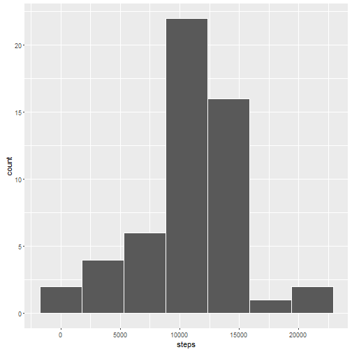
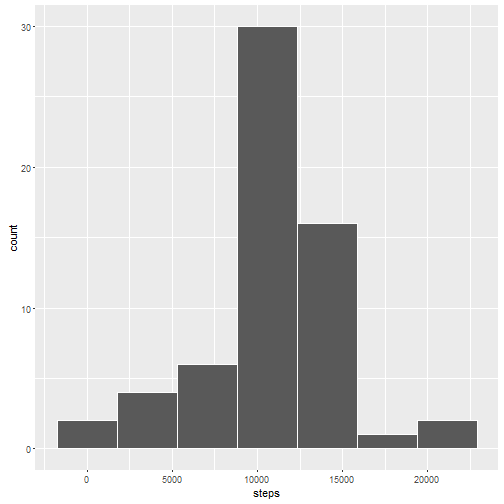
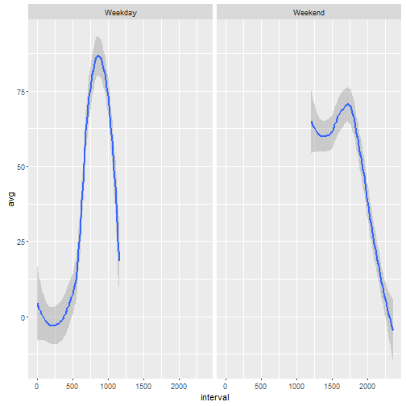

```r
act <- read.csv("activity.csv")
```


```r
library(ggplot2)
library(plyr)
library(dplyr)

byday <- tapply(act$steps, act$date, sum)
byday <- ldply(byday)
names(byday) <- c("day", "steps")
qplot(byday$steps, xlab = "steps", bins = 7, na.rm = TRUE, color = I("white"))
```




```r
mean(byday$steps, na.rm = TRUE)
```

```
## [1] 10766.19
```

```r
median(byday$steps, na.rm = TRUE)
```

```
## [1] 10765
```


```r
cleanact <- subset(act, !is.na(act$steps))
averages <- tapply(cleanact$steps, cleanact$interval, mean)
dfaverage <- ldply(averages)
names(dfaverage) <- c("interval", "steps")
plot(dfaverage$interval, dfaverage$steps, type = "l", xlab = "interval", ylab = "steps")
```


```r
head(arrange(dfaverage, desc(steps)),5)
```

```
##   interval    steps
## 1      835 206.1698
## 2      840 195.9245
## 3      850 183.3962
## 4      845 179.5660
## 5      830 177.3019
```

Interval 835 has the most steps(~206)


```r
length(subset(act$steps, is.na(act$steps)))
```

```
## [1] 2304
```


```r
missing <- act[is.na(act$steps),]
imputed <- merge(missing, dfaverage, by = "interval")
imputed <- imputed[,c(4, 3, 1)]
names(imputed) <- c("steps", "date", "interval")
act[is.na(act$steps),] <- imputed
```


```r
byday2 <- tapply(act$steps, act$date, sum)
byday2 <- ldply(byday2)
names(byday2) <- c("day", "steps")
qplot(byday2$steps, xlab = "steps", bins = 7, color = I("white"))
```




```r
##The mean and median increases when replacing N/As
mean(byday2$steps)
```

```
## [1] 10766.19
```

```r
median(byday2$steps)
```

```
## [1] 10766.19
```


```r
act$date <- strptime(act$date, format = "%Y-%m-%d")
act <- transform(act, date = weekdays(date))
act <- mutate(act, splitweek=ifelse(date %in% c("Monday","Tuesday","Wednesday","Thursday","Friday"), "Weekday","Weekend"))
act$splitweek <- as.factor(act$splitweek)
dataforplot <- act %>%
      group_by(interval, splitweek) %>%
      summarize(avg = mean(steps))
with(dataforplot, qplot(interval, avg, facets = (. ~ splitweek), geom = "smooth"))
```



